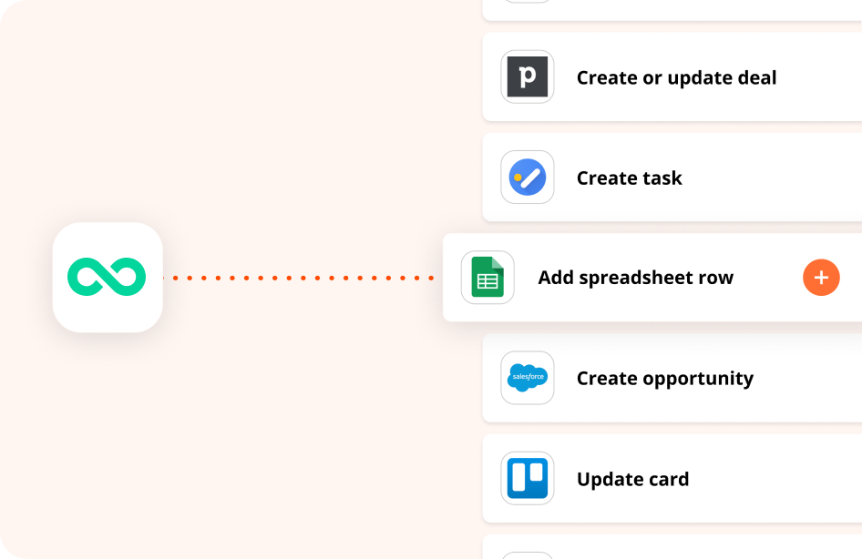

# zapier-woovi

Welcome to the Woovi integration app with Zapier! This app provides convenient access to the Woovi REST API, allowing you to easily integrate payment services with your Zapier integrations.

  

Integrate our [app](https://zapier.com/apps/woovi/integrations) into your integration today and be able to create instant payments using Woovi: charges, subscriptions, webhooks and more. Simplify and earn more.

## Documentation

See how you can integrate our app into your integration in our [documentation](https://developers.woovi.com/docs/integrations/zapier-with-woovi).

## License

This app is distributed under the terms of the [MIT license](LICENSE).