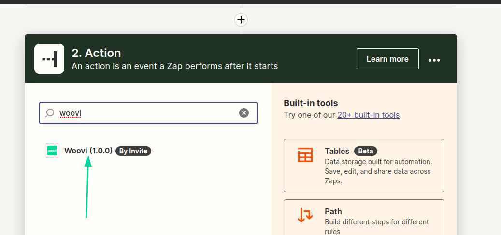
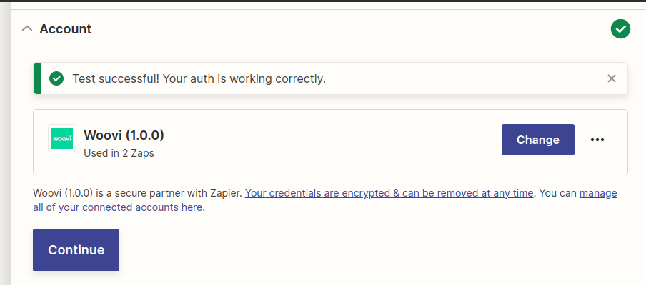

# Authentication test plan

## Pre-test
- Have an [zap for testing with an trigger](https://help.zapier.com/hc/en-us/articles/8496309697421-Create-Zaps).

## Configuring a new account using App ID
1. Add a new Woovi Action:
   

2. Proceed to the account creation step:
    

3. When entering a valid App ID, account connection should succeed:
   
