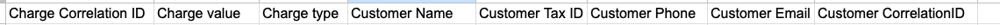
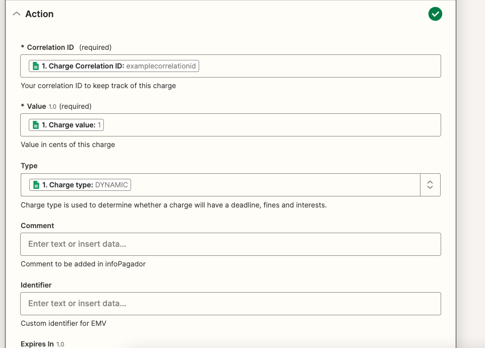
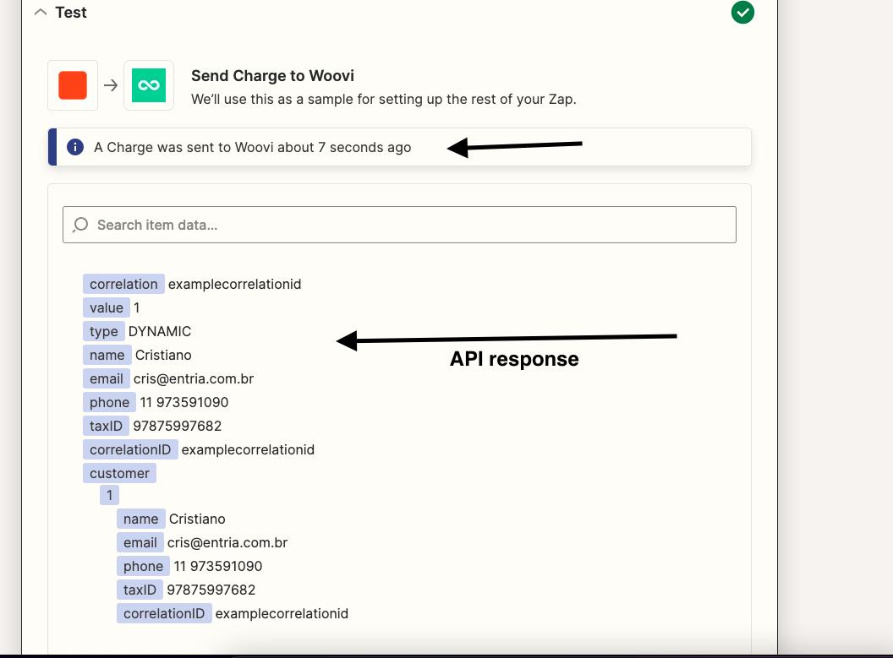

# Create charge testplan

## Creating an basic charge with customer
### Arrange
1. Have a spreadsheet for creating charges with the following structure:

2. Creates a Zap with a Google Sheets trigger for the "new row in spreadsheet" event, configuring which spreadsheet will activate the trigger.

3. Adds a new Woovi action with the `Create charge` event.

4. Configure the action with the spreadsheet columns:

### Act
5. Test the execution of the action using test step.

### Assert
6. The API response should be returned:
