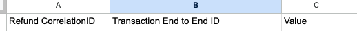
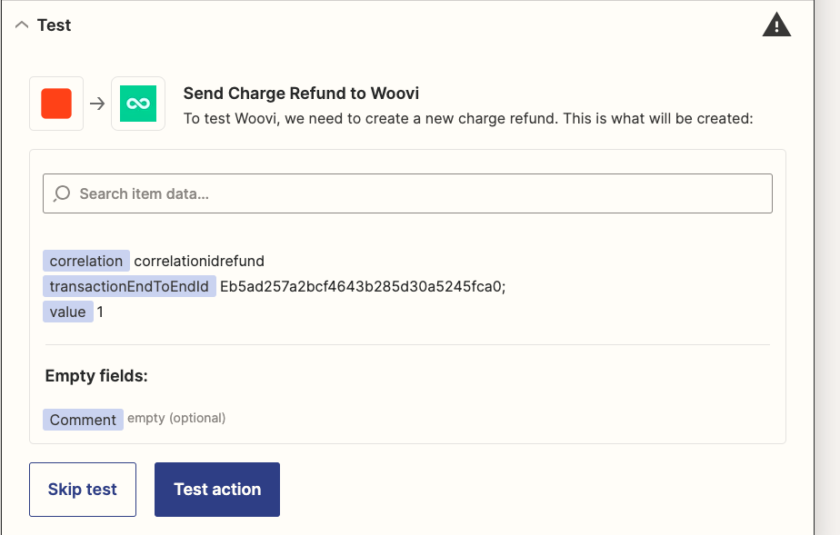
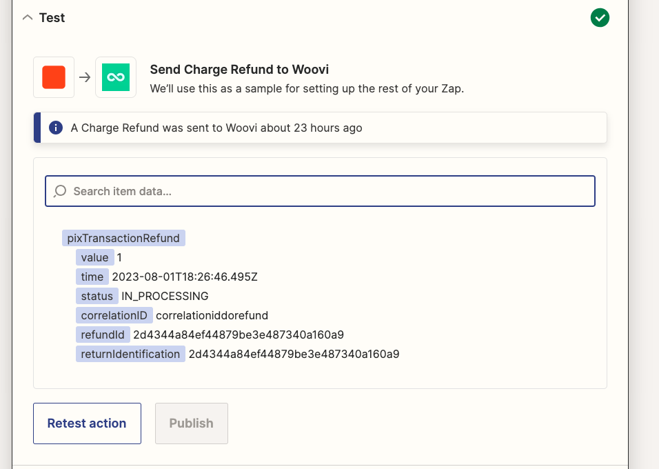

# Create a charge refund testplan

## Creating a charge refund
### Arrange
1. Have a spreadsheet for creating charge refunds with the following columns:

2. Adds one charge refund row into spreadsheet.

3. Creates a Zap with a Google Sheets trigger for the "New Spreadsheet Row" event, configuring which spreadsheet will activate the trigger.

4. Adds a new Woovi action with the `Create Charge Refund` event.

5. Configure the action fields to match the values fetched from the worksheet columns:

### Act
6. Click on _Test action_ button:

### Assert
7. There shouldn't be any errors as the API response, it should be a success response:
