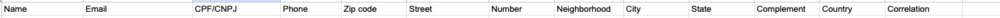
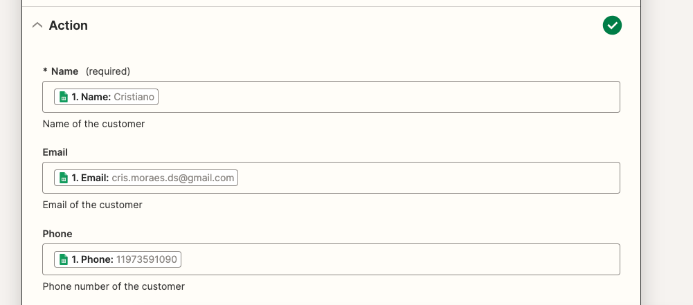
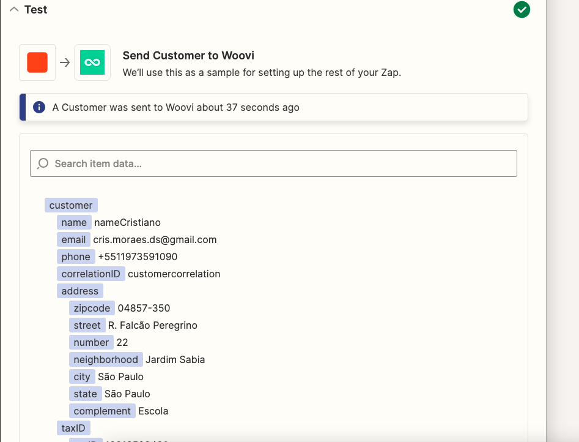

# Create a customer testplan

## Creating a customer
### Arrange
1. Have a spreadsheet for creating customers with the following columns:

2. Creates a Zap with a Google Sheets trigger for the "New Spreadsheet Row" event, configuring which spreadsheet will activate the trigger.

3. Adds a new Woovi action with the `Create Customer` event.

5. Configure the action fields to match the values fetched from the worksheet columns:

### Act
5. Click on _Test action_ button:

### Assert
6. There shouldn't be any errors as the API response, it should be a success response:
