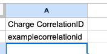
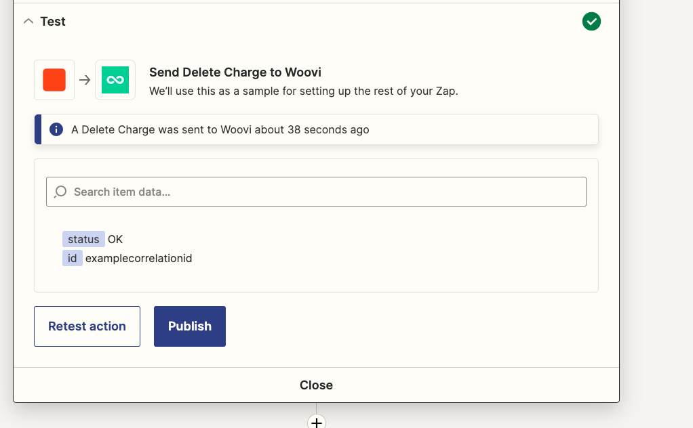

# Delete charge testplan

## Deleting an charge by correlation id
### Arrange
1. Have a spreadsheet for creating charges with the following structure:

2. Creates a Zap with a Google Sheets trigger for the "New Spreadsheet Row" event, configuring which spreadsheet will activate the trigger.

3. Adds a new Woovi action with the `Delete charge` event.

4. Configure the id field with spreadsheet correlationID column.

### Act
5. Click on _Test action_ button.

### Assert
6. There should be an API response with the status "OK.":
