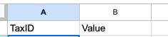
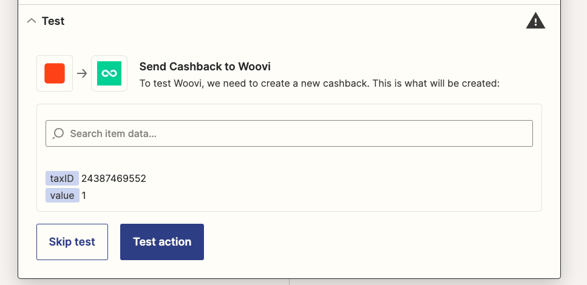
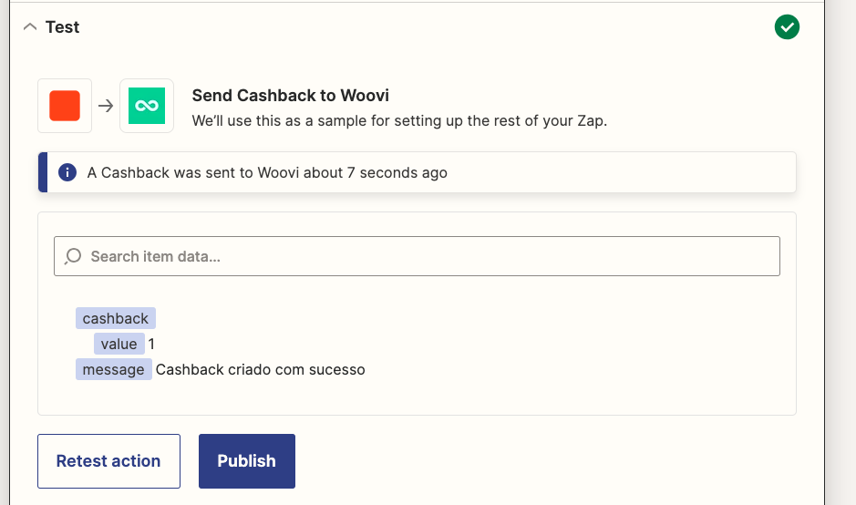

# Get or create cashback testplan

## Creating a cashback
### Arrange
1. Have a spreadsheet for creating cashbacks with the following columns:

   

2. Create a new customer.

2. Adds one cashback row into spreadsheet with same taxID as above customer.

3. Creates a Zap with a Google Sheets trigger for the "New Spreadsheet Row" event, configuring which spreadsheet will activate the trigger.

4. Adds a new Woovi action with the `Get or Create Cashback for a Customer` event.

5. Configure the action fields to match the values fetched from the worksheet columns:

### Act
6. Click on _Test action_ button:

### Assert
7. There shouldn't be any errors as the API response, it should be a success response:
