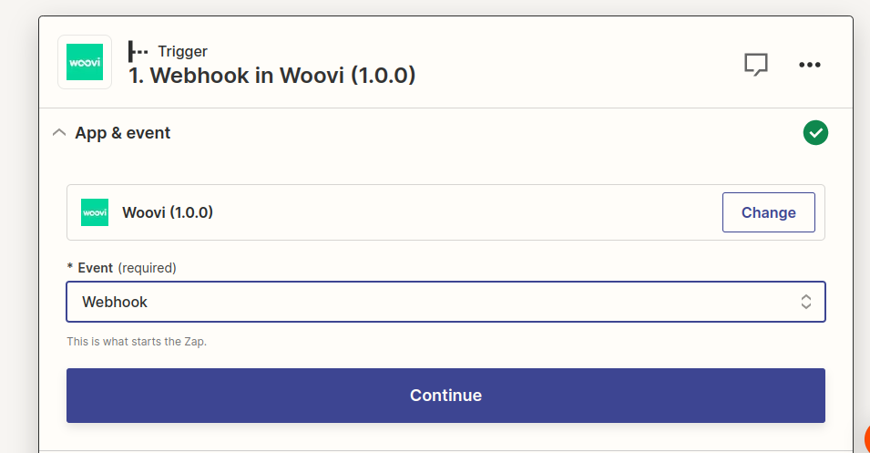
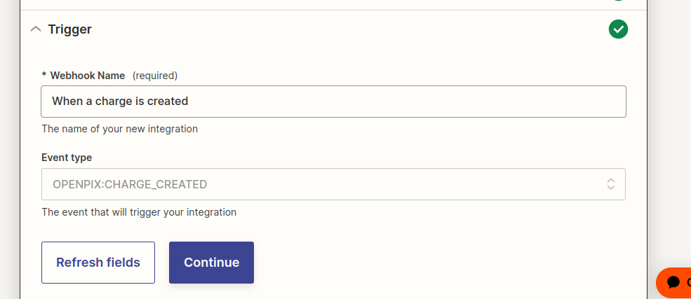
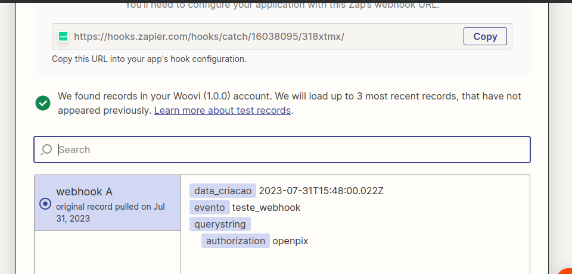
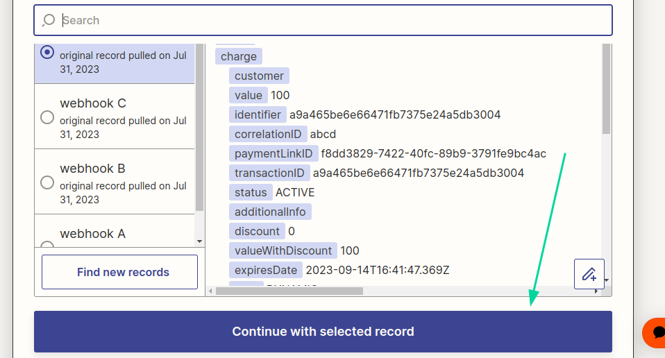
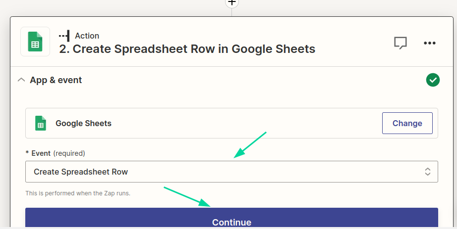
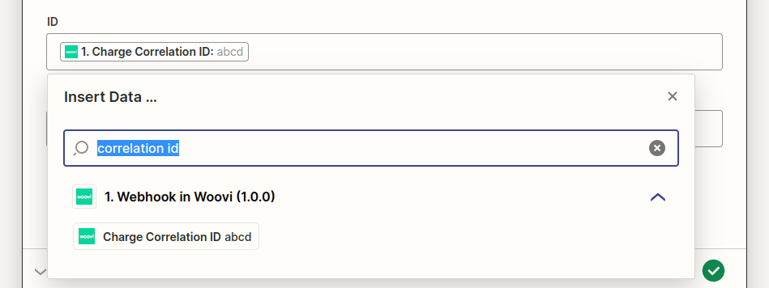
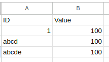

# Webhook trigger test plan

## Pre-test
- Have an [blank zap for testing](https://help.zapier.com/hc/en-us/articles/8496309697421-Create-Zaps).

## Adding an `webhook` trigger
1. Create a trigger with webhook event:

   

2. Setup webhook trigger with `OPENPIX:CHARGE_CREATED` event:

   

3. Copy the webhook url in test step:
    

4. Create a new webhook on API with the following cURL command:
   ```bash
   export APP_ID="YOUR_APP_ID"
   export ZAPIER_WEBHOOK_URL="YOUR_WEBHOOK_URL"
   curl --location 'https://api.openpix.com.br/api/v1/webhook' \
   --header 'Content-Type: application/json' \
   --header 'Accept: application/json' \
   --header "Authorization: $APP_ID" \
   --data "{
   \"webhook\": {
      \"name\": \"When a charge is created\",
      \"event\": \"OPENPIX:CHARGE_CREATED\",
      \"url\": \"${ZAPIER_WEBHOOK_URL}\",
      \"authorization\": \"openpix\",
      \"isActive\": true
   }
   }"
   ```

5. The webhook will be configured in the API and tested on Zapier:

   

## Receiving an webhook

1. Have the webhook trigger for the `OPENPIX:CHARGE_CREATED` event configured.

2. Generate a sample charge on the platform, update the trigger, and use the webhook received with the `OPENPIX:CHARGE_CREATED` event as the selected record in test step of trigger:

   

3. Create a new action to add a new row in a Google Sheet:

   

4. Configure the action, selecting which worksheet to place the new charges created.

5. Select the "Charge Correlation ID" field in a column displayed in the action. In this example, we are telling you to use the correlationID field in the "ID" column in the worksheet:

   

6. Now, when creating a new charge on platform, a new line must be present in the worksheet:

   